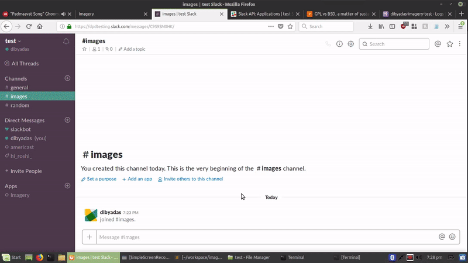

# Imagery

 

Imagery is a slack bot that takes any uploaded image, hosts it on Imgur and posts the link to the same channel after deleting the uploaded image, thus, saving space on a free plan.

## GIF Demo

<h3 align="center"></h3>

## Setup

Deploy this app on heroku and install the app on slack. Create account on Imgur and get a `Client-ID`
Add `slack_access_token` and `client_id` to the environment variables in Heroku config.

## Updates

Imagery now sends a private message that asks if the image is to be uploaded to Imgur. (In case it's an private image)

## TODO
- [ ] Add support for other file types (?)

## Contributions

PRs and feature suggestions welcome! :D 

